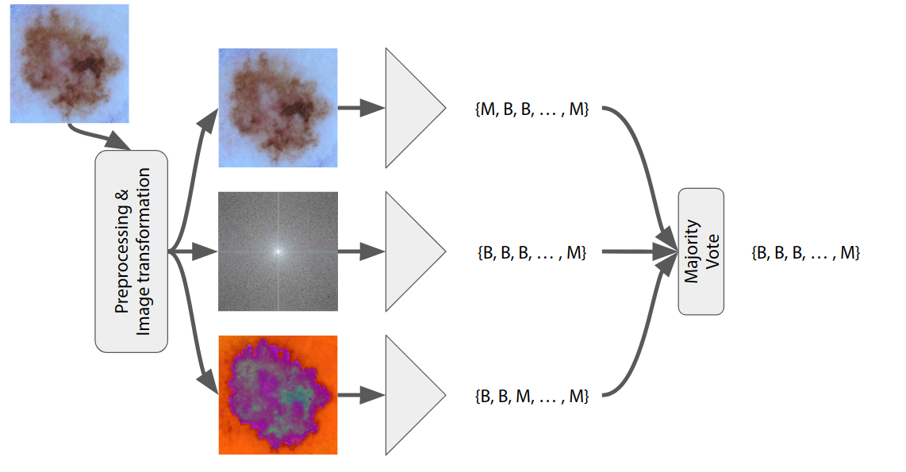

# Skin Lesion Classification: Transformation-based approach to CNNs




## Installing / Getting started
A minimal setup you need to get running.

### Requirements
- NVIDIA GPU 
- cuda 
- cudnn
- python 3
- pip

### Setting up

#### Sonnet and TensorFlow
Compile and Install [Sonnet](https://github.com/deepmind/sonnet/#installation-instructions) and [TensorFlow](https://www.tensorflow.org/install/) using their guides for use with at least 1 GPU.

#### Virtual Environment (Recommended)
The following commands are assuming several locations which may be different for your system.
[virtualenvwrapper](http://virtualenvwrapper.readthedocs.io/en/latest/index.html)

```shell
sudo -H pip install virtualenvwrapper
mkvirtualenv --python=/usr/bin/python3 isic-cnn
git clone 
```

## Resources

### Dataset

[ISIC-archive](https://isic-archive.com/)

### Paper


[Skin Lesion Classification: Transformation-based approach to CNNs](http://ghassanalregib.com/)


